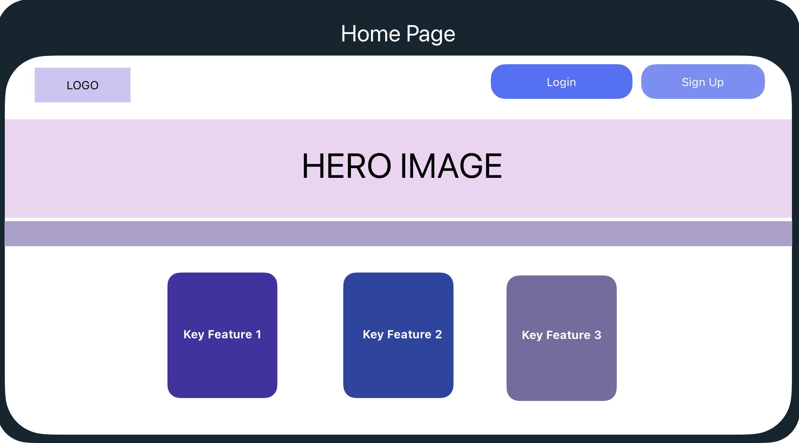
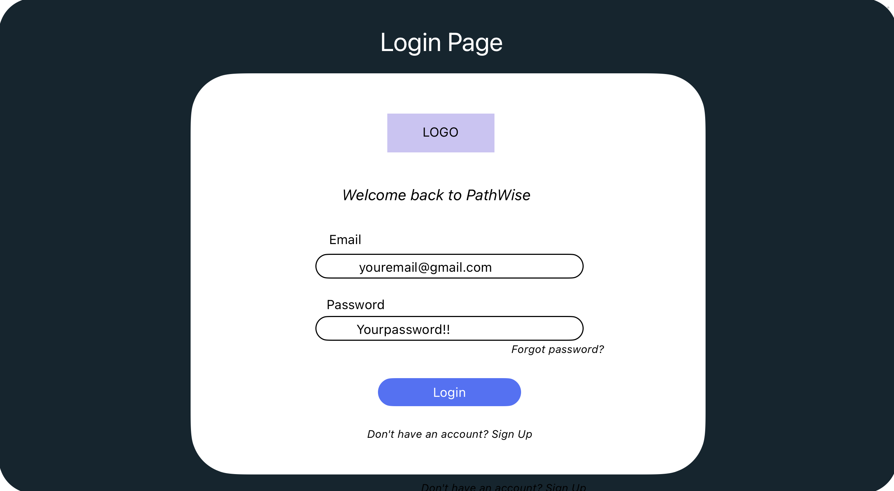
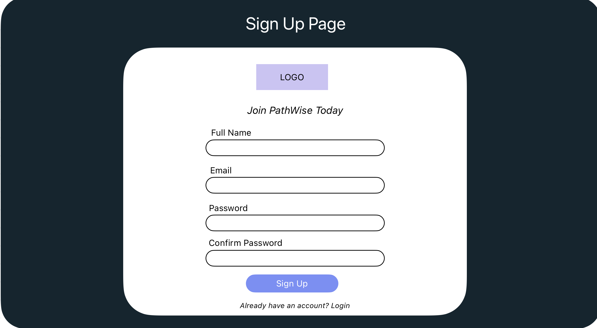
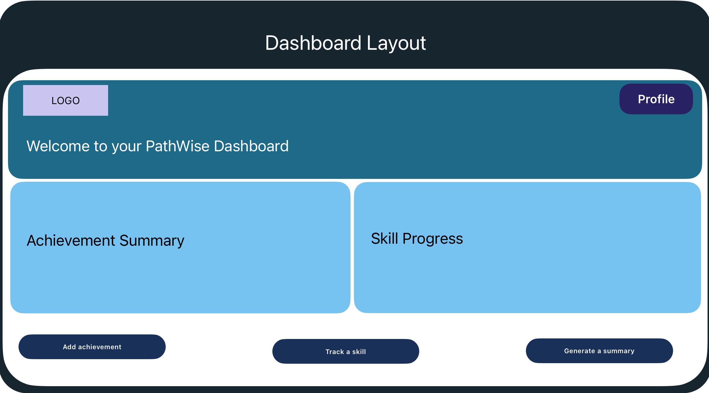
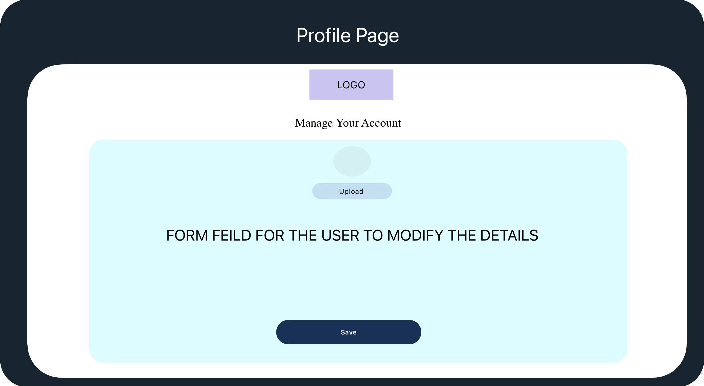
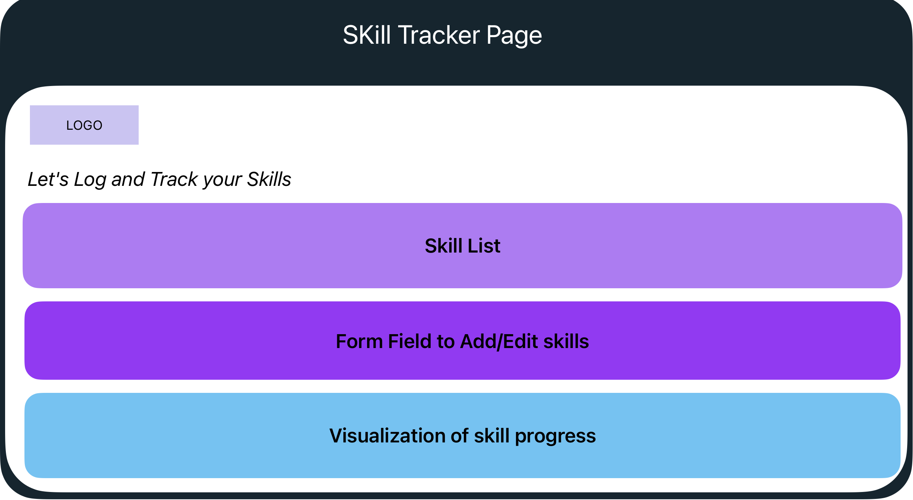
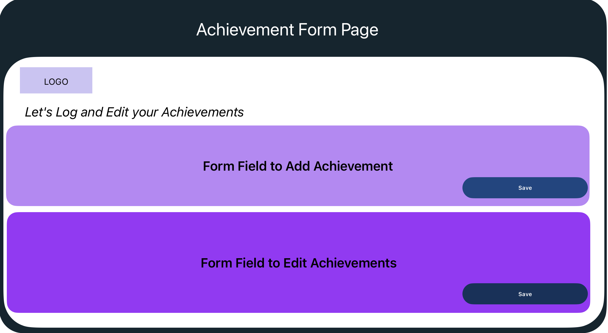
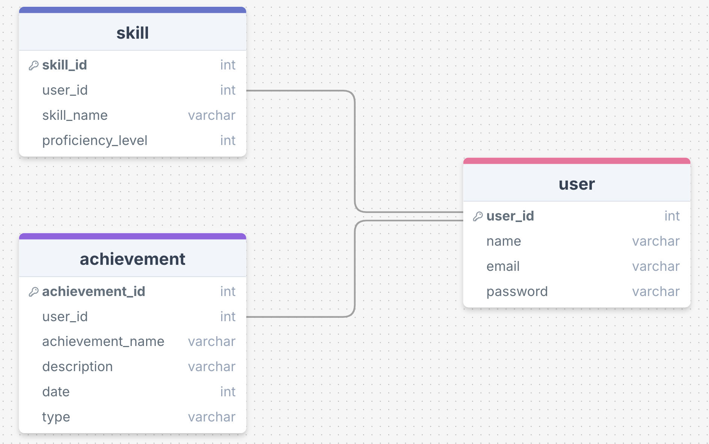

# PathWise

## Overview

A web application which enables the user to visualize, track and also share their **personal and educational growth**. They will be able to track the skills and create a shareable summary which will highlight their development. The app **bridges the gap between traditional resumes and provides more in detail of lifelong learning**.

### Problem Space

Conventional resumes just highlight a person's employment history and don't highlight their ongoing education and skill development. This restriction makes it challenging for people to demonstrate their development in a comprehensive way and for businesses to evaluate applicants based on a proven learning trajectory. By providing an easy-to-use platform for recording and visualizing these milestones in a way that is both personal and professional, Pathwise addresses this issue.

### User Profile

- **Target Users**
 > Professionals and students who needs to document their personal and  professional growth to achieve success in their career journey.
 > Employers and hiring managers assessing candidates to find the most compatible employee with expected workspace qualities and technical skills

 - **Usage**
 > Users will log achievements such as certifications, projects, courses
 > Track skills with visual progress indicators

### Features

- **User Login Mockup** 
- **Achievement login** : Add, edit, delete achievements with feilds for name, description, type and date
- **Dashboard overview** : Display visual summary of the skills and achievements
- **Responsive Design** : Accessible on mobile and desktop devices

## Implementation

### Tech Stack

**FrontEnd**
- React  
- Boostrap
- Charts.js (Visualization) 

**BackEnd**  
- Node.js
- Express.js

**DataBase**
- MySQL

**Authentication**
- Passport.js

### APIs

N/A

### Sitemap

**1. Homepage**
> App introduction, key featues and Login/Sign up

**2. Login Page**
> Mockup login page

**3. Skill Tracker**
> Page for tracking and veiwing skill progress

**4. Acheivement Form**
> Interface for editing and loging milestones

**5. Profile Page**
> Manage user information 

### Mockups

### Data

### Endpoints

- **POST /signup**
> Parameters : **email, password, name**
> Response : Success or error message

- **POST /login**
> Parameters : **email, password**
> Response: Success (user info) or error message.

- **Get /dashboard**
> Response: User’s achievements and skills data

- **POST /achievemnts**
> Parameters : **name, description, type, date**
> Response: Success or error message

- **PUT /achievemnts{id}**
> Parameters: **name, description, type, date**
> Response: Success or error message

- **DELETE /achievemnts{id}**
> Response: Success or error message

## Roadmap

- **Day 1**

> Set up the database schema 
> Implement basic server structure for handling requests
> Connect backend to the database

- **Day 2-3**

> Design the dashboard layout
> Implement front-end components for displaying data
> Set up API calls between the front end and the backend to pull data
> Begin integrating data such as achievements, progress, and skills into the dashboard

- **Day 4-5**

> Design achievement and skill tracking models in the database
> Implement backend functionality to add, update, and view achievements and skills
> Build front-end components to display tracked achievements and skills
> Integrate achievement and skill tracking into the user dashboard

- **Day 6-7**

> Design and develop the skill tracker page layout 
> Implement the functionality to allow users to update and track their skills
> Ensure proper data flow between the backend and frontend for the skill tracker page

- **Day 8-9**

> Finalize the user profile UI
> Perform testing of all features (functionality, usability, responsiveness)
> Debug and fix any issues identified during testing

## Future Implementations

**User Authenticatin** : Allow user authentication and signup

**Shareable Link** : Allow the user to share a whole summary

**Advanced Search and filters** : Allow the user to refine the details as needed.

**Public profiles** : User can showcase their potential publicly

**Gamification** : Add badges and milestones in their growth 
